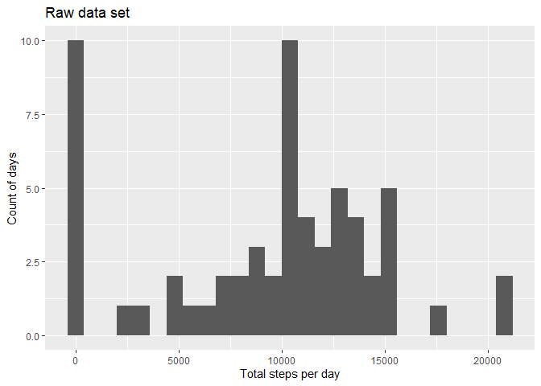
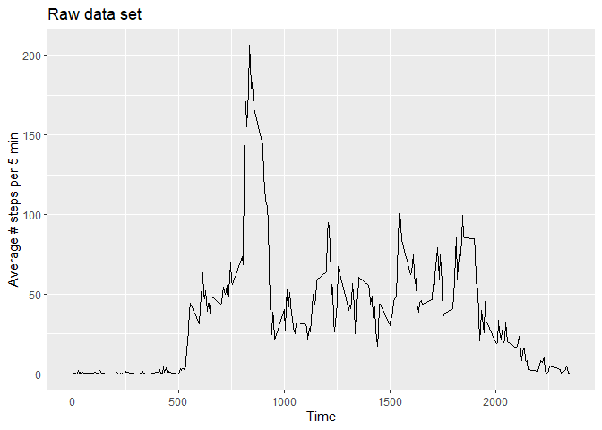
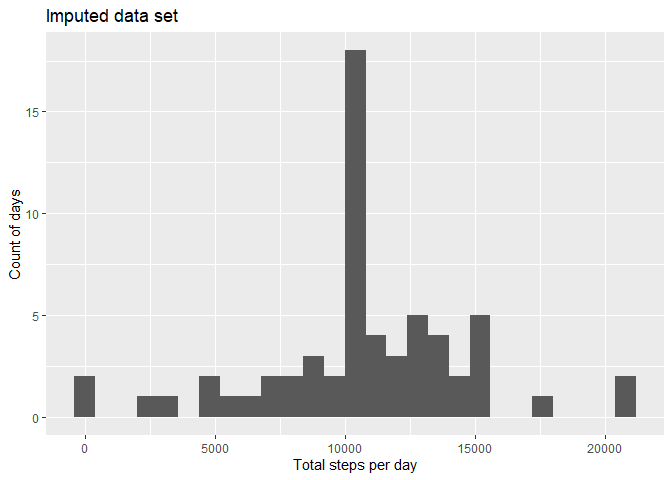
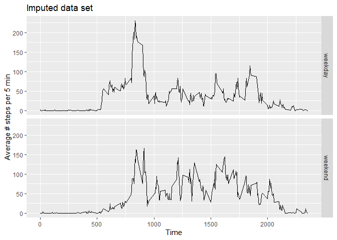

## Loading and preprocessing the data
Unzip the raw data, load it to a data frame, and look at its structure.

```r
library(dplyr)
```

```
## 
## Attaching package: 'dplyr'
```

```
## The following objects are masked from 'package:stats':
## 
##     filter, lag
```

```
## The following objects are masked from 'package:base':
## 
##     intersect, setdiff, setequal, union
```

```r
unzip("activity.zip")
DT <- read.csv("activity.csv")
str(DT)
```

```
## 'data.frame':	17568 obs. of  3 variables:
##  $ steps   : int  NA NA NA NA NA NA NA NA NA NA ...
##  $ date    : chr  "2012-10-01" "2012-10-01" "2012-10-01" "2012-10-01" ...
##  $ interval: int  0 5 10 15 20 25 30 35 40 45 ...
```

## What is mean total number of steps taken per day?

```r
library(xtable)
library(ggplot2)

# Calculate the total number of steps by date
DT_day <- DT %>%
  group_by(date) %>%
  summarise(total_steps = sum(steps, na.rm = TRUE),
            .groups = 'drop')

# Calculate mean and median
mean_DT_day <- mean(DT_day$total_steps, na.rm = TRUE)
median_DT_day <- median(DT_day$total_steps, na.rm = TRUE)

# Visualise by histogram
g <- ggplot(DT_day, aes(x=total_steps))
g + geom_histogram(binwidth = 800) +
  labs(x="Total steps per day", y="Count of days",
       title = "Raw data set")
```

<!-- -->

The mean value of total number of steps taken per day is 9354.2295082 and the median value is 10395.

## What is the average daily activity pattern?

```r
# Calculate the total number of steps by date
DT_day_ave <- DT %>%
  group_by(interval) %>%
  summarise(ave_steps = mean(steps, na.rm = TRUE),
            .groups = 'drop')

# Calculate the time interval that has the maximum steps
interval_max_id <- which(DT_day_ave$ave_steps == max(DT_day_ave$ave_steps))

# Visualise by time step
g <- ggplot(DT_day_ave, aes(x=interval, y=ave_steps))
g + geom_line() +
  labs(x="Time", y="Average # steps per 5 min",
       title = "Raw data set")
```

<!-- -->

The time interval that has the maximum steps on average is 835.

## Imputing missing values

```r
# The total number of rows with NAs
narow_count <- sum(apply(DT, 1, anyNA))

# Impute with the average steps of that interval
imp_steps <- function(x, y) {
  if (is.na(x)) {
    i <- which(DT_day_ave$interval == y)
    return(DT_day_ave$ave_steps[i])
  } else{return(x)}
}

# Create a new dataset that fills missing values
DT_imputed <- DT %>%
  rowwise() %>%
  mutate(steps = imp_steps(steps, interval))

# Calculate the total number of steps by date
DT_imputed_day <- DT_imputed %>%
  group_by(date) %>%
  summarise(total_steps = sum(steps, na.rm = TRUE),
            .groups = 'drop')

# Calculate mean and median
mean_DT_imputed_day <- mean(DT_imputed_day$total_steps, na.rm = TRUE)
median_DT_imputed_day <- median(DT_imputed_day$total_steps, na.rm = TRUE)

# Visualise it by histogram
g <- ggplot(DT_imputed_day, aes(x=total_steps))
g + geom_histogram(binwidth = 800) +
  labs(x="Total steps per day", y="Count of days",
       title = "Imputed data set")
```

<!-- -->

There are 2304 of rows that have missing values. After filling the missing values, the mean value of total number of steps taken per day is 1.0766189\times 10^{4} and the median value is 1.0766189\times 10^{4}. They are greater than the ones calculated using the raw data set.

## Are there differences in activity patterns between weekdays and weekends?

```r
# Define a function to convert a date into factor c("weekday", "weekend")
wd <- function(x) {
  if(weekdays(x) %in% c("Saturday", "Sunday")) {"weekend"} else {
    "weekday"
  }
}

# Add a new factor variable to the data set
DT_imputed <- DT_imputed %>%
  mutate(date = as.Date(date, format="%Y-%m-%d")) %>%
  mutate(day = as.factor(wd(date)))

# Calculate the average daily steps pattern by weekday and weekend
DT_imputed_day_ave <- DT_imputed %>%
  group_by(interval, day) %>%
  summarise(ave_steps = mean(steps), .groups = 'drop')

# Plot the two types of activity patterns
g <- ggplot(DT_imputed_day_ave, aes(interval, ave_steps))
g + geom_line() + facet_grid(day~.) +
  labs(x="Time", y="Average # steps per 5 min",
       title = "Imputed data set")
```

<!-- -->

Seen from the graph, weekdays feature with greater number of steps during morning time (8:35) than the rest of the day. However, weekends feature with a more spread number of steps.
